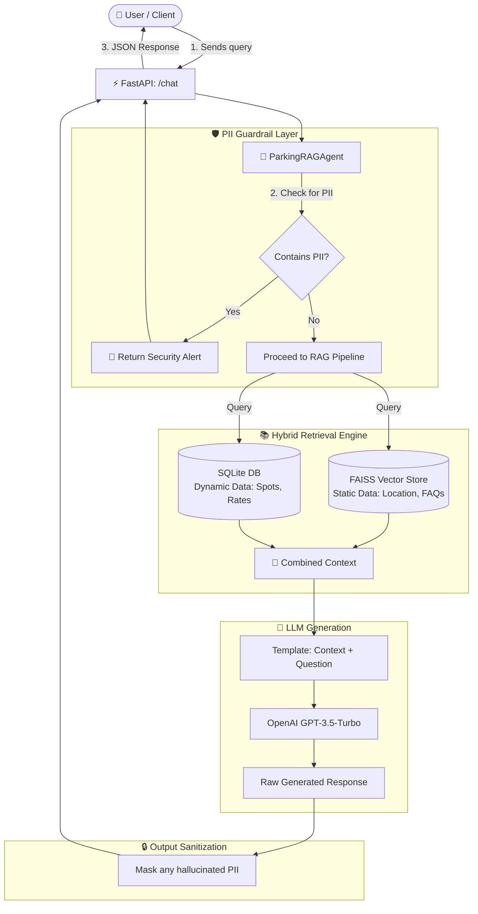

# 🚗 Parking Space Reservation Chatbot — Stage 1: RAG System & Guardrails

[](https://www.python.org/downloads/)
[](https://fastapi.tiangolo.com)
[](https://www.langchain.com/)
[](https://github.com/facebookresearch/faiss)
[](https://github.com/EminnKurtt/parking-chatbot-stage1/actions)
[](LICENSE)

An intelligent, privacy-first conversational AI system for parking space inquiries and reservation assistance. This repository contains the complete implementation of **Stage 1**: a hybrid **Retrieval-Augmented Generation (RAG)** architecture with multi-layer **PII (Personally Identifiable Information) guardrails**, built on **LangChain**, **FastAPI**, **FAISS**, and **SQLite**.

---

## 📑 Table of Contents

- [📌 Overview & Objectives](#-overview--objectives)
- [🏗️ System Architecture & Workflow](#️-system-architecture--workflow)
- [✨ Key Features](#-key-features)
- [📂 Project Structure](#-project-structure)
- [🚀 Step-by-Step Installation Guide](#-step-by-step-installation-guide)
  - [1. Prerequisites](#1-prerequisites)
  - [2. Clone the Repository](#2-clone-the-repository)
  - [3. Set Up Virtual Environment](#3-set-up-virtual-environment)
  - [4. Install Dependencies](#4-install-dependencies)
  - [5. Configure Environment Variables](#5-configure-environment-variables)
- [💻 Running the Application](#-running-the-application)
  - [Starting the FastAPI Server](#starting-the-fastapi-server)
  - [API Documentation (Swagger UI)](#api-documentation-swagger-ui)
  - [Sample API Request & Response](#sample-api-request--response)
- [🛡️ Privacy & Guardrails Layer](#️-privacy--guardrails-layer)
- [📊 Evaluation & Quality Metrics](#-evaluation--quality-metrics)
- [🧪 Running Unit Tests](#-running-unit-tests)
- [🔄 CI/CD Pipeline](#-cicd-pipeline)
- [🗺️ Project Roadmap](#️-project-roadmap)

---

## 📌 Overview & Objectives

In modern reservation systems, relying strictly on traditional LLM prompts can result in hallucinations, outdated dynamic data, and dangerous privacy leaks. 

This project solves these issues in **Stage 1** by implementing:
1. **Hybrid Retrieval**: Combining dense vector embeddings (FAISS) for static knowledge (locations, amenities, policies) with relational SQL queries (SQLite) for real-time dynamic facts (available spots, hourly rates, operating hours).
2. **PII Security & Guardrails**: Utilizing a dual-layer filtering engine (Regular Expressions + Microsoft Presidio NLP) to block or mask sensitive user data (e.g., credit card numbers, SSNs, phone numbers, emails).
3. **Microservice API**: A high-performance FastAPI endpoint exposing `/chat` for easy integration with frontend chat widgets or mobile apps.

---

## 🏗️ System Architecture & Workflow

The diagram below illustrates the end-to-end lifecycle of a user inquiry:



---

## ✨ Key Features

- **Hybrid RAG Pipeline**:
  - **Static Retrieval**: In-memory FAISS vector index with `OpenAIEmbeddings` for answering static inquiries (e.g., location, EV charging stations, 24/7 security, booking instructions).
  - **Dynamic Retrieval**: SQLite database storing up-to-the-minute operational parameters (e.g., dynamic spot counts, current hourly rates, working hours).
- **Two-Tier PII Guardrails**:
  - **Tier 1 (Fast Regex Engine)**: Immediate validation matching payment cards, US SSN, email addresses, and phone numbers.
  - **Tier 2 (Microsoft Presidio NLP Engine)**: Named entity recognition analyzer and anonymizer for deeper context-aware sanitization.
- **RESTful API with FastAPI**:
  - Strongly typed schemas with `Pydantic`.
  - Auto-generated interactive Swagger UI and ReDoc documentation.
  - Clean error handling and HTTP status codes.
- **Evaluation Framework**:
  - Quantitative metrics (`Precision` and `Recall@K`) to monitor the relevance of the retrieved context.
- **Automated CI/CD**:
  - GitHub Actions runs unit tests on Python 3.10 for every commit and pull request targeting `main`.

---

## 📂 Project Structure

```text
parking-chatbot-stage1/
├── app/
│   ├── __init__.py
│   └── main.py                 # FastAPI application and /chat endpoint
├── core/
│   ├── __init__.py
│   ├── config.py               # Settings and environment configuration
│   └── rag_agent.py            # Main RAG Agent orchestrator (LangChain)
├── database/
│   ├── __init__.py
│   ├── sql_db.py               # SQLite dynamic database interface
│   └── vector_db.py            # FAISS vector database initialization & retriever
├── guardrails/
│   ├── __init__.py
│   └── pii_filter.py           # Dual-layer PII detection and masking
├── evaluation/
│   ├── __init__.py
│   └── evaluate_rag.py         # Precision and Recall evaluation script
├── tests/
│   ├── __init__.py
│   ├── test_guardrails.py      # Unit tests for PII detection & masking
│   ├── test_rag_agent.py       # Unit tests for RAG pipeline response
│   ├── test_sql_db.py          # Unit tests for SQLite queries
│   └── test_vector_db.py       # Unit tests for FAISS vector retriever
├── .github/
│   └── workflows/
│       └── ci.yml              # GitHub Actions CI workflow
├── .env.example                # Example environment variable file
├── .gitignore                  # Git ignore rules
├── requirements.txt            # Python dependencies
└── README.md                   # Project documentation
```

---

## 🚀 Step-by-Step Installation Guide

Follow these steps to set up the project locally on your machine.

### 1. Prerequisites

- **Python 3.10+** installed on your system.
- An **OpenAI API Key** with access to embedding and chat models.
- **Git** installed on your machine.

### 2. Clone the Repository

```bash
git clone https://github.com/EminnKurtt/parking-chatbot-stage1.git
cd parking-chatbot-stage1
```

### 3. Set Up Virtual Environment

It is strongly recommended to use an isolated Python virtual environment:

**On Windows (PowerShell):**
```powershell
python -m venv venv
.\venv\Scripts\Activate.ps1
```

**On Linux / macOS:**
```bash
python3 -m venv venv
source venv/bin/activate
```

### 4. Install Dependencies

Install all required packages from `requirements.txt`:

```bash
pip install --upgrade pip
pip install -r requirements.txt
```

*(Optional NLP Model for Presidio)*:
If you want to use the full spaCy NLP engine for Microsoft Presidio, you can optionally download the language model:
```bash
python -m spacy download en_core_web_lg
```
> **Note:** If spaCy or the model is not installed, the system automatically and gracefully falls back to the high-speed Regex Guardrail layer without crashing.

### 5. Configure Environment Variables

Create your local `.env` configuration by copying the example:

**On Windows (PowerShell):**
```powershell
Copy-Item .env.example .env
```

**On Linux / macOS:**
```bash
cp .env.example .env
```

Open `.env` in your text editor and add your OpenAI API Key:
```ini
OPENAI_API_KEY=sk-proj-yourActualOpenAIApiKeyHere
```

---

## 💻 Running the Application

### Starting the FastAPI Server

Run the application using `uvicorn`:

```bash
uvicorn app.main:app --reload --host 0.0.0.0 --port 8000
```
Or execute directly with Python:
```bash
python app/main.py
```

Output:
```text
INFO:     Uvicorn running on http://0.0.0.0:8000 (Press CTRL+C to quit)
INFO:     Started reloader process
INFO:     Application startup complete.
```

### API Documentation (Swagger UI)

Once running, access the interactive API docs directly in your browser:
- **Swagger UI:** [http://localhost:8000/docs](http://localhost:8000/docs)
- **ReDoc:** [http://localhost:8000/redoc](http://localhost:8000/redoc)

---

### Sample API Request & Response

#### 1. General Inquiry (Static + Dynamic Info)

**Request (cURL):**
```bash
curl -X POST "http://127.0.0.1:8000/chat" \
     -H "Content-Type: application/json" \
     -d '{"message": "What is your hourly rate and where are you located?"}'
```

**Request (PowerShell):**
```powershell
Invoke-RestMethod -Uri "http://127.0.0.1:8000/chat" -Method Post `
  -Headers @{"Content-Type"="application/json"} `
  -Body '{"message":"What is your hourly rate and where are you located?"}'
```

**Response:**
```json
{
  "response": "Our parking facility is located at 123 Main Street, Downtown. The current rate is $5.00 per hour, and we are open 24/7 with 42 spots available."
}
```

#### 2. Reservation Request

**Request:**
```json
{
  "message": "I would like to reserve a parking spot."
}
```

**Response:**
```json
{
  "response": "Certainly! To make a reservation, please provide your Name, Car Number, and the Reservation Period."
}
```

#### 3. Sensitive Data Attempt (Guardrail Trigger)

**Request:**
```json
{
  "message": "Here is my credit card 4111-2222-3333-4444 to pay in advance."
}
```

**Response:**
```json
{
  "response": "Security Alert: Sensitive data (e.g., credit card, SSN) detected. Please do not share personal information."
}
```

---

## 🛡️ Privacy & Guardrails Layer

Data security is critical for conversational booking agents. The `PIIGuardrail` module (`guardrails/pii_filter.py`) operates as a dual-layer firewall:

| Layer | Technology | Handled Entities | Strategy |
| :--- | :--- | :--- | :--- |
| **Layer 1: Deterministic** | Compiled RegEx | `CREDIT_CARD`, `PHONE_NUMBER`, `EMAIL_ADDRESS`, `US_SSN` | Fast pre-validation before calling LLM APIs |
| **Layer 2: Statistical NLP** | Microsoft Presidio | Contextual PII entities & names | Masking / Anonymization in responses |

- **Input Guardrail**: Evaluates queries before sending them to the LLM. If high-risk data is detected, execution stops early with a polite security warning, protecting user privacy and preventing token waste.
- **Output Guardrail**: Sanitizes the generated response text to prevent any unintended LLM data leaks or hallucinations.

---

## 📊 Evaluation & Quality Metrics

To ensure retrieval quality and reduce hallucinations, the project includes an automated evaluation script (`evaluation/evaluate_rag.py`):

```bash
python -m evaluation.evaluate_rag
```

**Sample Output:**
```text
Evaluation Results:
Precision: 1.00
Recall@K: 1.00
Note: In production, use a larger dataset and LLM-as-a-judge for evaluation.
```

- **Recall@K**: Measures the proportion of relevant ground-truth facts successfully retrieved in the top-$K$ context documents ($K=2$).
- **Precision**: Measures whether the retrieved context contains accurate information matching the inquiry.

---

## 🧪 Running Unit Tests

The test suite validates database initialization, vector retrieval, PII filtering, and RAG agent logic:

```bash
pytest tests/ -v
```

**Expected Result:**
```text
tests/test_database.py::test_sql_db PASSED                      [ 25%]
tests/test_database.py::test_vector_db PASSED                   [ 50%]
tests/test_guardrails.py::test_pii_detection PASSED             [ 75%]
tests/test_guardrails.py::test_pii_masking PASSED               [100%]

============================== 4 passed in 2.15s ==============================
```

---

## 🔄 CI/CD Pipeline

The project uses **GitHub Actions** (`.github/workflows/ci.yml`) to ensure code stability:
- Automatically triggered on `push` and `pull_request` to the `main` branch.
- Sets up Python 3.10 on an `ubuntu-latest` runner.
- Installs dependencies and runs the entire `pytest` suite.

> **Tip**: If you configure repository secrets on GitHub under `Settings -> Secrets and variables -> Actions`, add `OPENAI_API_KEY` to allow live RAG tests during CI.

---

## 🗺️ Project Roadmap

- [x] **Stage 1 (Current)**:
  - Hybrid RAG implementation (FAISS + SQLite).
  - PII Guardrails with Regex & Microsoft Presidio.
  - FastAPI `/chat` endpoint.
  - Unit tests & GitHub Actions CI pipeline.
- [ ] **Stage 2 (Next)**:
  - Multi-turn conversation state machine (LangGraph / StateGraph).
  - Slot-filling validation for reservation details (Name, Car Plate, Timeframe).
  - Dynamic reservation recording into SQLite.
- [ ] **Stage 3**:
  - Mock payment gateway integration (Stripe / Mock Pay).
  - SMS / Email booking confirmations.
  - Docker containerization & cloud deployment (AWS / GCP / HuggingFace Spaces).

---

## 👨‍💻 Author & Contributions

- **Developer:** [Emin Kurt](https://github.com/EminnKurtt)
- **Repository:** [parking-chatbot-stage1](https://github.com/EminnKurtt/parking-chatbot-stage1)

Contributions, issues, and feature requests are welcome! Feel free to open an issue or submit a pull request.